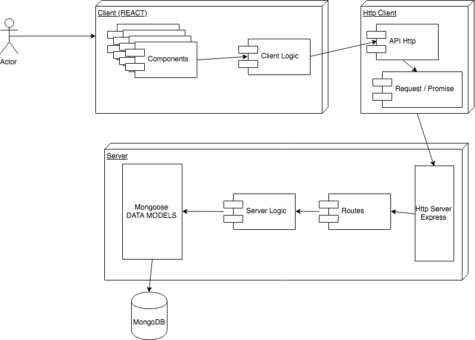
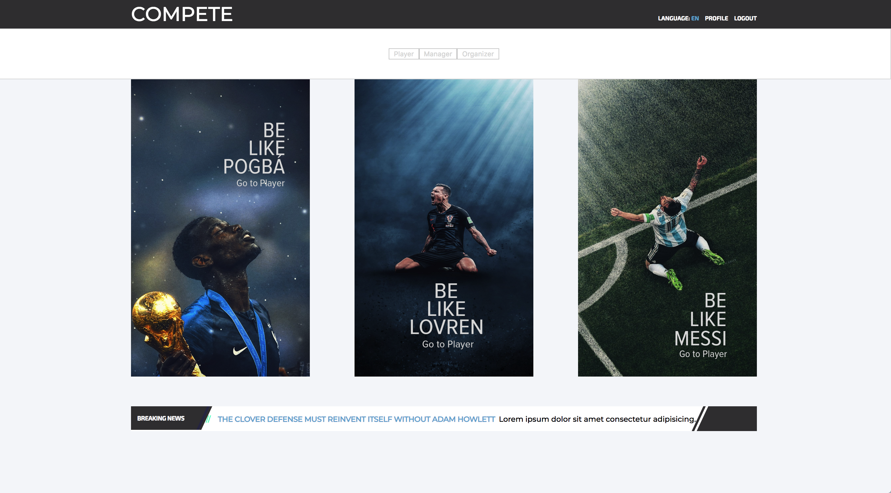
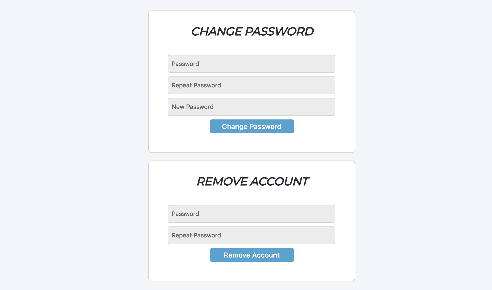
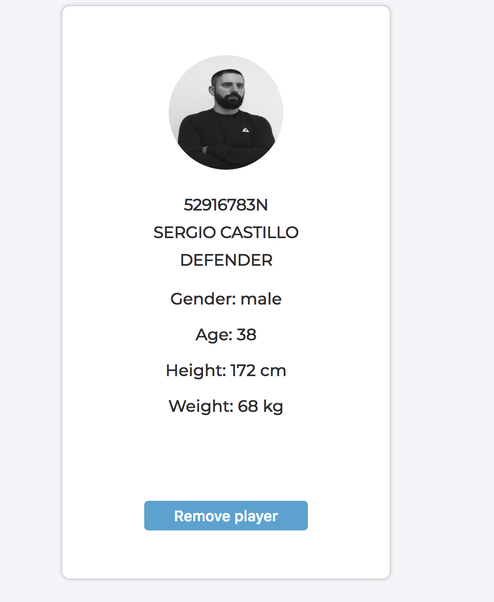
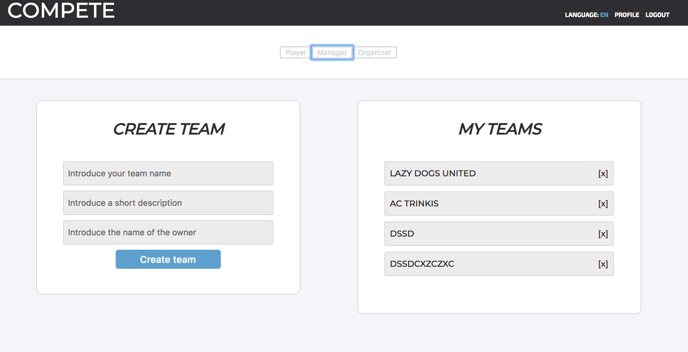
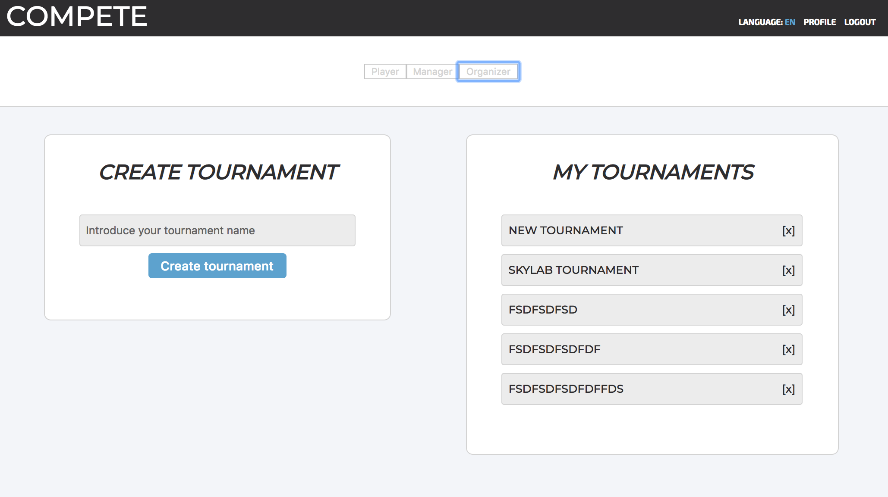
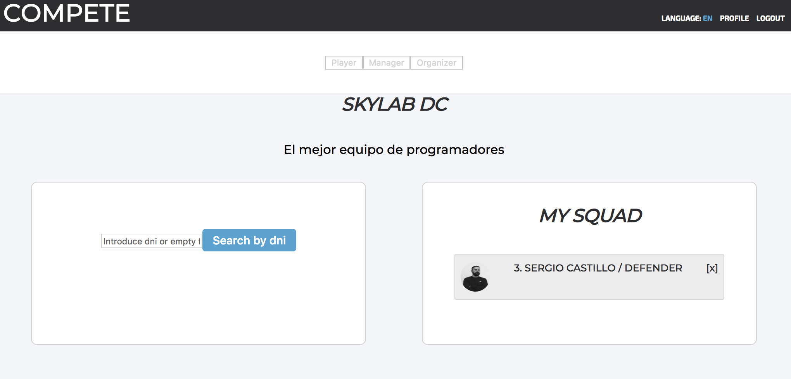
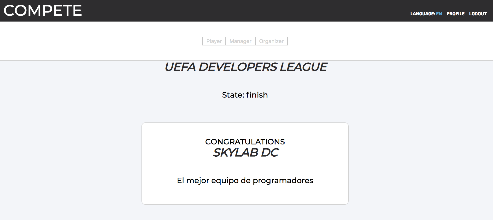

# Compete v.1.0.0

**INTRODUCTION**

COMPETE / TOURNAMENT FOOTBALL MANAGER

Compete is an application to organize and manage players, teams and knockouts tournaments with a maximum of 32 teams, and without needing a number of teams in base two: which means that the application itself is responsible for managing any number of equipment entered.
Although originally designed for the management of football indoor qualifying tournaments, I thought it would be convenient to use a more generic name since in the future you can take charge of different tournament models: sports (football, basketball, tennis, ... ), game type eSports or any other type that you can think of: the Api part is so versatile that it can be combined with other applications: for example, a good chess application could be combined to mount leagues and chess tournaments in the same application ;).

This is due to the use of different roles according to the user's actions.

Compete manages three types of user roles: player, manager and organizer. And although they are linked in some way, I managed to partially untie the elimination tournament mode in order to expand the global vision of the application in the future and accept other tournaments modes like league or champions league.

**TARGET** 

**Compete** 

The application is able to reach all types of users: either to manage a futsal tournament, which is what it was originally intended for, and / or any other type of elimination tournament: sports competitions, eSports, poker tournaments, chess, etc.. 

**TECHNOLOGIES**

- Html5 and Javscript ES6. 
- CSS with BEM and SASS.
- Mocha for testing.
- React.js
- Node.js
- JWT
- Express
- Mongodb
- Mongoose

**FUNCTIONAL DESCRIPTION**

The LANDING is the first application's page where the user may register and/or login to start the application and apreciate the different options: at this point we need a valid email and password.

The HOME is the principal page where you can see a little news viewer, the profile panel and the navigation bar with three principal options: Player, Manager and Organizer.

In the PROFILE panel the user can change the password or remove the account.

The PLAYER section allows the user to be a football player. He only needs to complete the form: dni, name, surname, age, weight, height, gender, position, squad number and photography. Then, you are in the other page where you can see the player information and the teams where he is playing in. The user can remove him as a player.

The MANAGER sections allows the user to create, manage and remove a team. You can access to the TEAM page and add or remove players to the team.

The ORGANIZER sections allows the user to create, manage and remove a tournament. You can access to the TOURNAMENT page and add or remove teams to the tournament. Whe the tournament is ready to start the organizer access to the Tournament Informations where he can see the matches of the round and add results.

#### UML Diagram about functional description

Use Case Diagram:

**TECHNICAL DESCRIPTION**

Architecture:

#### UML Diagram about technical description

Data Model Diagram:

**DESIGN**

#### Landing

#### Home 

#### Profile

#### Player

#### Manager

#### Organizer

#### Team

#### Tournament

**AUTHOR**

- Sergio Castillo
