# Compete v.1.0.0

**INTRODUCTION**

COMPETE / GESTOR DE LIGAS Y COMPETICIONES DEPORTIVAS (Y NO TAN DEPORTIVAS)

Compete es una aplicación para organizar y gestionar jugadores, equipos y torneos eliminatorios con un máximo de 32 equipos y sin necesidad de un número de equipos en base dos. La propia aplicación se encarga de gestionar cualquier número de equipos introducidos. 
Aunque en un principio está pensada para la gestión de torneos eliminatorios de fútbol sala, creí conveniente utilizar un nombre más genérico ya que en un futuro puede hacerse cargo de diferentes modelos de torneos: de tipo deportivo (fútbol, báloncesto, tenis, ...), de tipo game (eSports) o de cualquier otro tipo que se os pueda ocurrir: la parte de Api es tan versátil que puede llegar a combinarse con otras aplicaciones: por ejemplo, una buena aplicación de ajedrez podría llegar a poder combinarse para montar ligas y torneos de ajedrez en una misma aplicación. 

Esto es debido al uso de diferentes roles según las acciones del usuario.

Compete gestiona tres tipos de roles de usuario: player, manager y organizer. Y aunque están vinculados de alguna manera, he conseguido desvincular en parte el modo torneo eliminatorio para en un futuro ampliar la visión global de la aplicación. 

**TARGET** 

**Compete** es capaz de llegar a todo tipo de usuarios: ya sea para gestionar un torneo de fútbol sala, que es para lo que está pensado en un principio, y/o cualquier otro tipo de torneo eliminatorio: competiciones deportivas, eSports, torneos de poker, ajedrez, 

**TECHNOLOGIES**

- Html5 and Javscript ES6. 
- CSS and BOOTSTRAP para dar estilos.
- Mocha para testear la lógica.
- React.js
- Node.js
- Express
- Mongodb

**FUNCTIONAL DESCRIPTION**

The user may register and/or login to search different ingredients. Then, he or she could click on each list to see the details of this nutrient. It is also possible to add them to a favorite list that can find on the nav bar.

#### UML Diagram about functional description

Use Case Diagram:

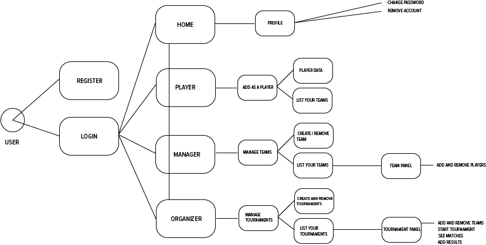

Flow Diagram:

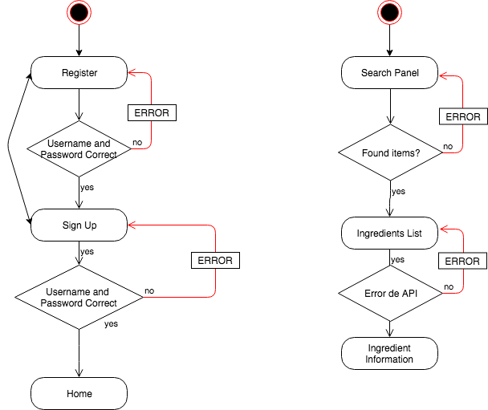

**TECHNICAL DESCRIPTION**

We can see in the diagrams below the flow of the app.

#### UML Diagram about technical description

Block Diagram:

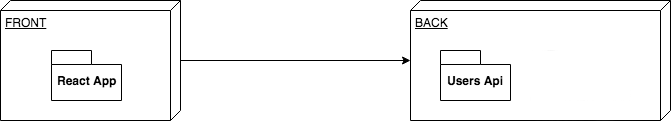

Components Diagram:

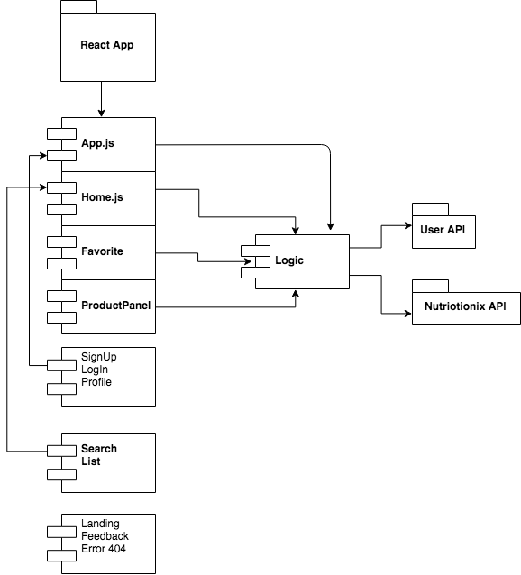

Data Model Diagram:

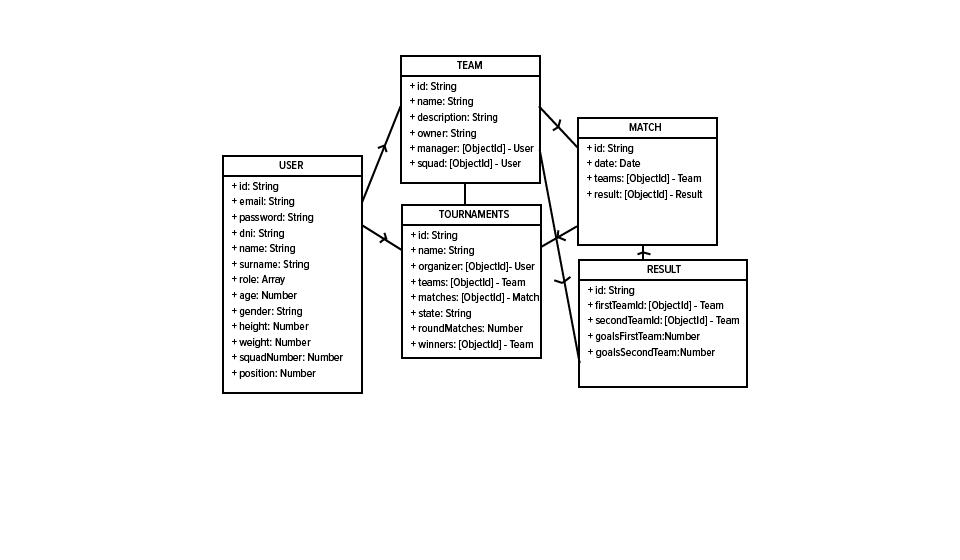

Classes Diagram:

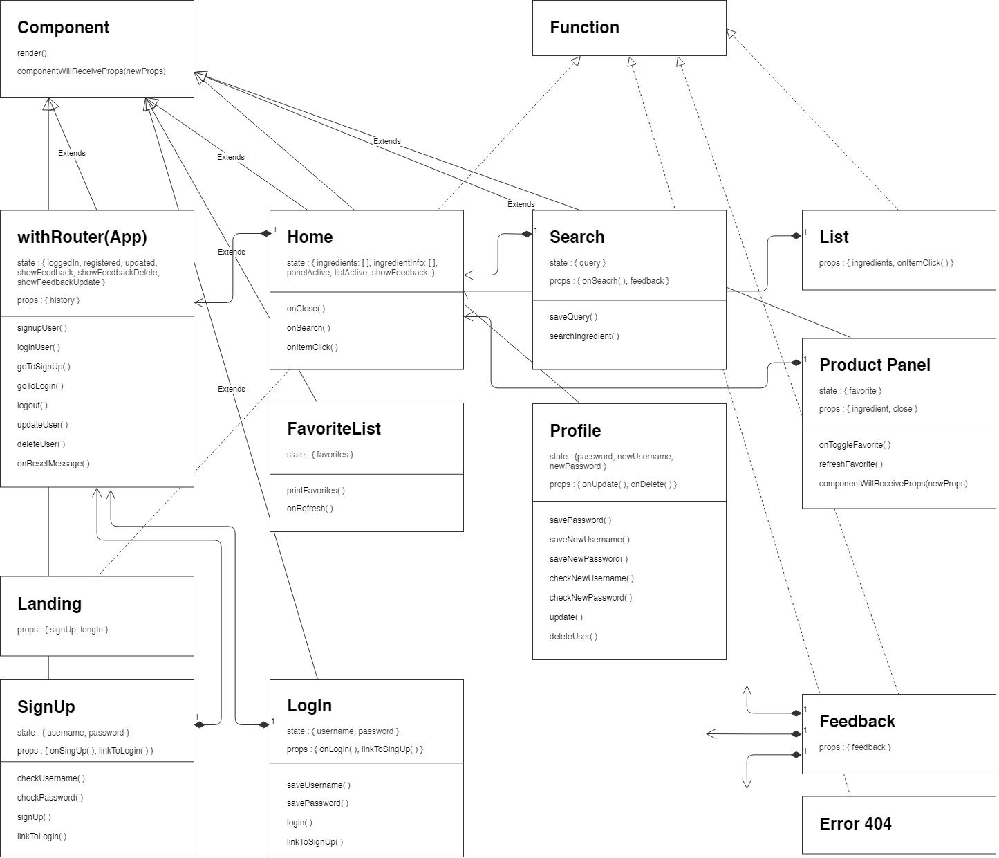

**DESIGN**

#### Landing

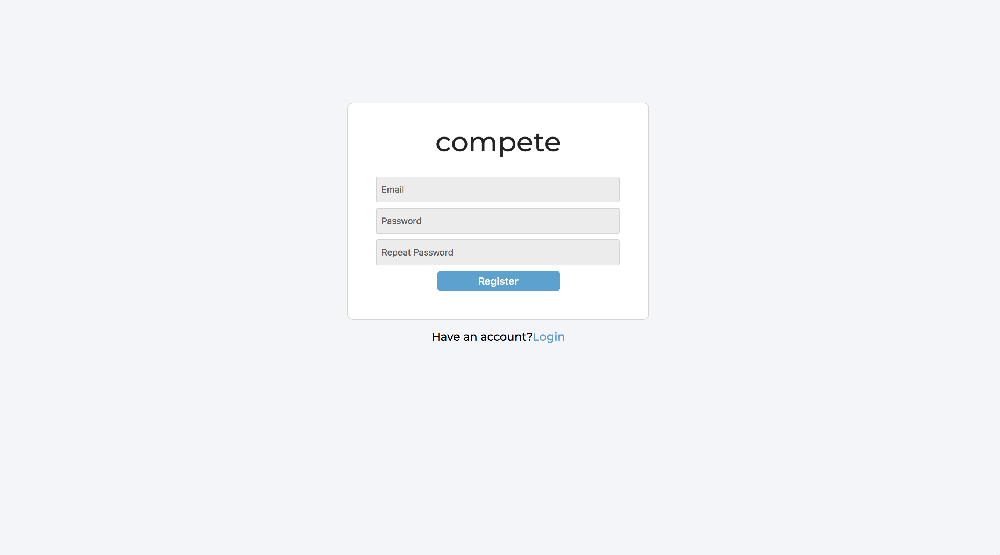

#### SingUp / LogIn

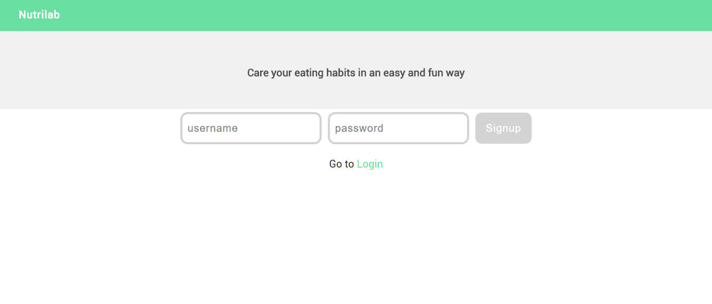

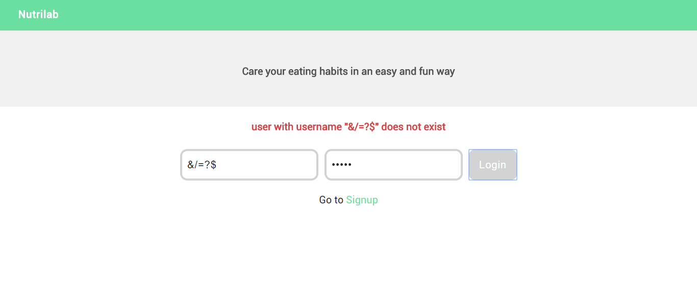

#### Home / Search Panel

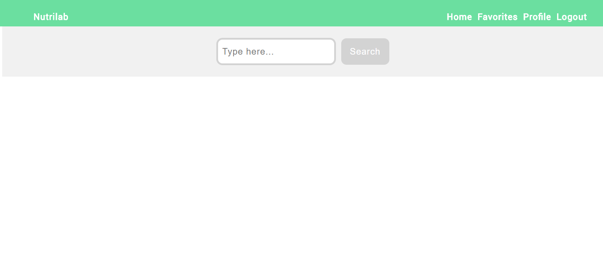

#### Profile

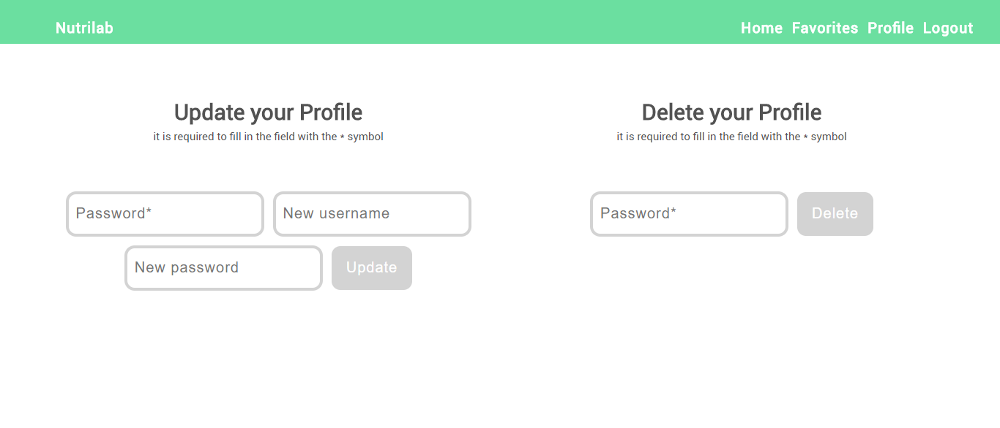

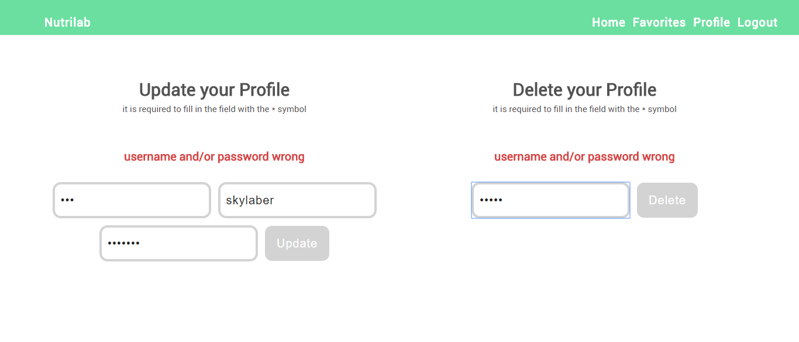

#### Ingredients List

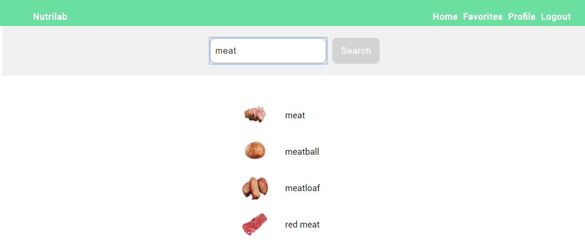

#### Ingredient Information

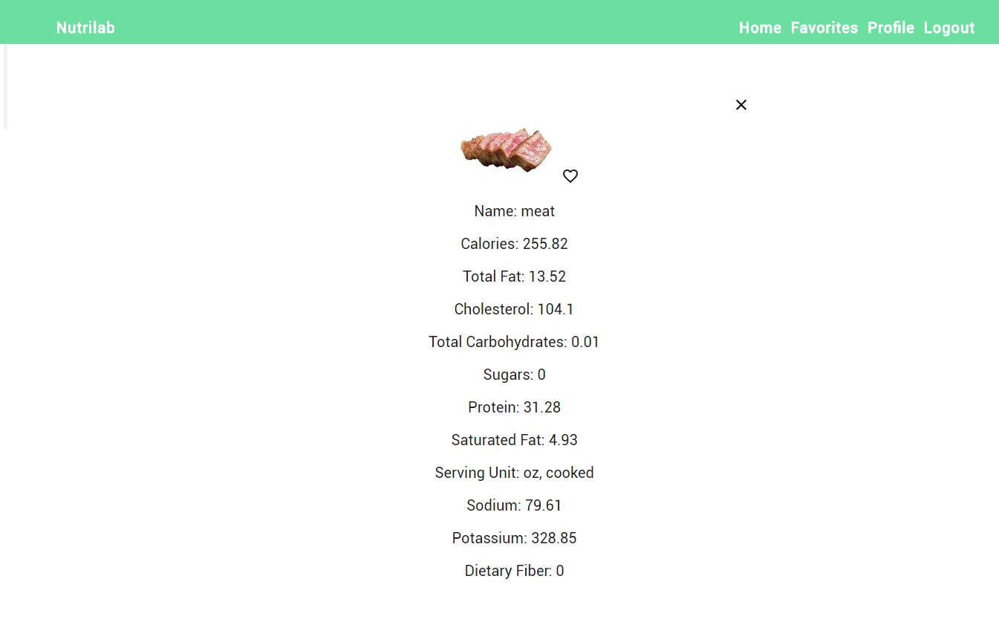

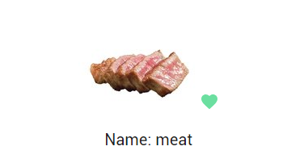

#### Favorite List

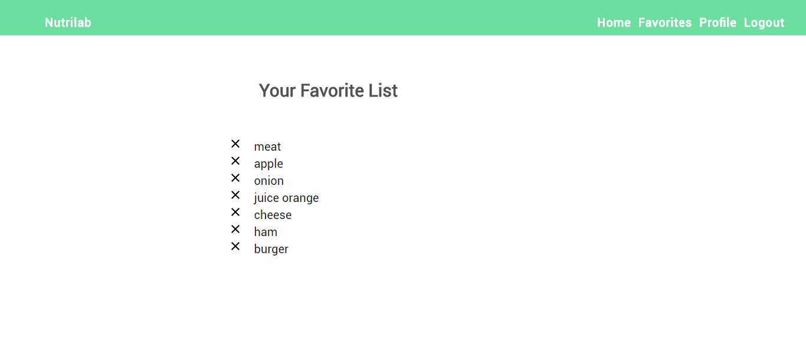

**AUTHOR**

- Sergio Castillo
